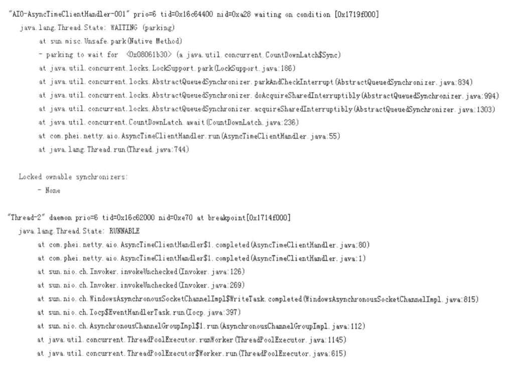

# AIO

#CompletionHandler
在jstack中显示如下

从"Thread-2"线程堆栈可知，JDK底层通过线程池ThreadPoolExecutor来执行回调通知，
异步回调通知类由sun.nio.ch.AsynchronousChannelGroupImpl实现，通过层层调用最后回到completed方法，完成回调通知。

- 可知，AsynchronousSocketChannel是被动执行对象，不需要像NIO一样创建一个线程来处理读写操作。

- 对于AsynchronousSocketChannel和AsynchronousServerSocketChannel，他们都是由JDK底层的线程池负责回调并驱动读写操作

