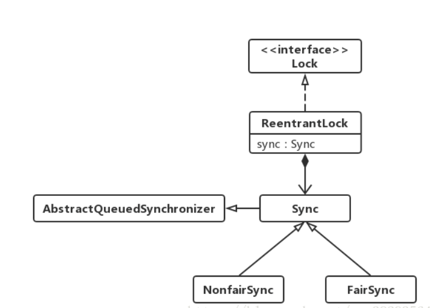

# ReentrantLock(重入锁)

jdk中独占锁的实现除了使用关键字synchronized外,还可以使用ReentrantLock。虽然在性能上ReentrantLock和synchronized没有什么区别，但ReentrantLock相比synchronized而言功能更加丰富，使用起来更为灵活，也更适合复杂的并发场景。




# 独占锁，并且可重入
- [代码](https://github.com/kiwi5691/NetworkCommunication/blob/master/javaIO/AIO/src/main/java/aio/ReentrantLock/ReentrantLockTest.java)


ReentrantLock是可以重入的锁,当一个线程获取锁时,还可以接着重复获取多次

加上ReentrantLock的的独占性，可以得出ReentrantLock和synchronized的相同点。

- ReentrantLock和synchronized都是独占锁,只允许线程互斥的访问临界区。但是实现上两者不同:synchronized加锁解锁的过程是隐式的,用户不用手动操作,优点是操作简单，但显得不够灵活。一般并发场景使用synchronized的就够了；ReentrantLock需要手动加锁和解锁,且解锁的操作尽量要放在finally代码块中,保证线程正确释放锁。ReentrantLock操作较为复杂，但是因为可以手动控制加锁和解锁过程,在复杂的并发场景中能派上用场。

- ReentrantLock和synchronized都是可重入的。synchronized因为可重入因此可以放在被递归执行的方法上,且不用担心线程最后能否正确释放锁；而ReentrantLock在重入时要却确保重复获取锁的次数必须和重复释放锁的次数一样，否则可能导致其他线程无法获得该锁。

- 与synchronized唯一不同的是，synchronized只能拥有一把锁，而Lock可以同时有很多把锁。不同的锁专门用于锁不同的线程

# ReentrantLock 额外功能

### ReentrantLock可以实现公平锁

`公平锁是指当锁可用时,在锁上等待时间最长的线程将获得锁的使用权。`
而非公平锁则随机分配这种使用权。和synchronized一样，默认的ReentrantLock实现是非公平锁,因为相比公平锁，非公平锁性能更好。当然公平锁能防止饥饿,某些情况下也很有用。在创建ReentrantLock的时候通过传进参数true创建公平锁,如果传入的是false或没传参数则创建的是非公平锁
```java
ReentrantLock lock = new ReentrantLock(true);
```
通过其构造函数的源码可以看到
```java
/**
 * Creates an instance of {@code ReentrantLock} with the
 * given fairness policy.
 *
 * @param fair {@code true} if this lock should use a fair ordering policy
 */
public ReentrantLock(boolean fair) {
    sync = fair ? new FairSync() : new NonfairSync();
}
```

- 公平锁和非公平锁的实现关键在于成员变量sync的实现不同,这是锁实现互斥同步的核心

- 大部分情况下我们使用非公平锁，因为其性能比公平锁好很多。但是公平锁能够避免线程饥饿

- [代码](https://github.com/kiwi5691/NetworkCommunication/blob/master/javaIO/AIO/src/main/java/aio/ReentrantLock/ReentrantFairLockTest.java)
###  ReentrantLock可响应中断
- 当使用synchronized实现锁时,阻塞在锁上的线程除非获得锁否则将一直等待下去，也就是说这种无限等待获取锁的行为无法被中断。
- 而ReentrantLock给我们提供了一个可以响应中断的获取锁的方法lockInterruptibly()。该方法可以用来解决死锁问题。


- [代码](https://github.com/kiwi5691/NetworkCommunication/blob/master/javaIO/AIO/src/main/java/aio/ReentrantLock/ReentrantLockInterruptibly.java)

### 获取锁时限时等待
- ReentrantLock还给我们提供了获取锁限时等待的方法tryLock()
可以选择传入时间参数,表示等待指定的时间,无参则表示立即返回锁申请的结果:true表示获取锁成功,false表示获取锁失败。
- 可以使用该方法配合失败重试机制来更好的解决死锁问题。


- [更好的解决死锁的代码](https://github.com/kiwi5691/NetworkCommunication/blob/master/javaIO/AIO/src/main/java/aio/ReentrantLock/ReentrantTryLockTest.java)

#  结合Condition实现等待通知机制
- 使用synchronized结合Object上的wait和notify方法可以实现线程间的等待通知机制。
- ReentrantLock结合Condition接口同样可以实现这个功能。而且相比前者使用起来更清晰也更简单。

- [代码](https://github.com/kiwi5691/NetworkCommunication/blob/master/javaIO/AIO/src/main/java/aio/ReentrantLock/ConditionTest.java)

### Condition接口提供的基本方法

```java
void await() throws InterruptedException;
void awaitUninterruptibly();
long awaitNanos(long nanosTimeout) thows InterruptedException;
boolean await(long time,TimeUnit unit) throws InterruptedException;
boolean awaitUntil(Date deadline) throws InterruptedException;
void signal();
void signalAll();
```


##### Condition由ReentrantLock对象创建,并且可以同时创建多个

```java
static Condition notEmpty = lock.newCondition();
```

- Condition接口在使用前必须先调用ReentrantLock的lock()方法获得锁
- 之后调用Condition接口的await()将释放锁,并且在该Condition上等待
- 直到有其他线程调用Condition的signal()方法唤醒线程

`使用方式和wait,notify类似。`


#### Condition优点

Condition具有比wait()/notify()更好的灵活性，具体体现在：

- 一个锁实例，可以绑定多个Condition实例，实现多路通知；

- notify()方法进行通知时，是随机进行选择的，但重入锁结合Condition对象，可以实现有选择性的通知，这是非常重要的。

