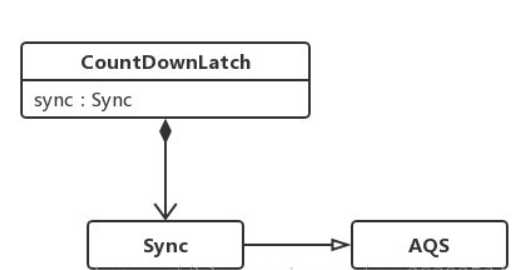
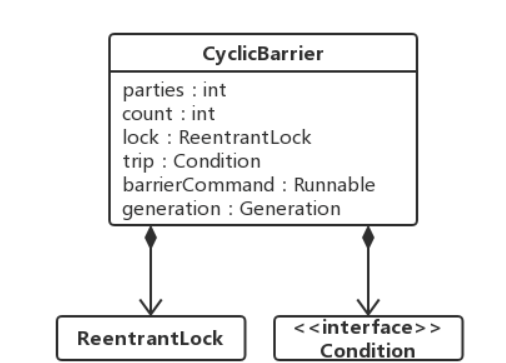

# CountDownLatch、Semaphore和CyclicBarrier

JAVA并发包中java.util.concurrent有三个类用于同步一批线程的行为，分别是CountDownLatch、Semaphore和CyclicBarrier。

# CountDownLatch

- CountDownLatch是在java1.5被引入，跟它一起被引入的工具类还有CyclicBarrier、Semaphore、concurrentHashMap和BlockingQueue。

- CountDownLatch是一个计数器闭锁，通过它可以完成类似于阻塞当前线程的功能

一个线程或多个线程一直等待，直到其他线程执行的操作完成。

- CountDownLatch用一个给定的计数器来初始化，该计数器的操作是原子操作

即同时只能有一个线程去操作该计数器


#### 概念
- 调用该类await方法的线程会一直处于阻塞状态，直到其他线程调用countDown方法使当前计数器的值变为零，每次调用countDown计数器的值减1。当计数器值减至零时，所有因调用await()方法而处于等待状态的线程就会继续往下执行。
- 这种现象只会出现一次，因为计数器不能被重置，如果业务上需要一个可以重置计数次数的版本，可以考虑使用CycliBarrier。

#### 场景

在某些业务场景中，程序执行需要等待某个条件完成后才能继续执行后续的操作；典型的应用如并行计算，当某个处理的运算量很大时，可以将该运算任务拆分成多个子任务，等待所有的子任务都完成之后，父任务再拿到所有子任务的运算结果进行汇总。

#### 源码


- countDownLatch类中只提供了一个构造器

CountDownLatch内部依赖Sync实现，而Sync继承自AQS

```java
//参数count为计数值，count是执行的线程数
//可以在CountDownLatchTest试着把2换成1
public CountDownLatch(int count) {
    if (count < 0) throw new IllegalArgumentException("count < 0");
    this.sync = new Sync(count);
}
```

- Sync是CountDownLatch的静态内部类

```java
private static final class Sync extends AbstractQueuedSynchronizer {}
```


- 类中有三个重要的方法
```java
//调用await()方法的线程会被挂起，它会等待直到count值为0才继续执行
public void await() throws InterruptedException { 
    sync.acquireSharedInterruptibly(1);
};   
//和await()类似，只不过等待一定的时间后count值还没变为0的话就会继续执行
public boolean await(long timeout, TimeUnit unit) throws InterruptedException { };  
//将count值减1
public void countDown() { };  
```

- await()方法调用了AQS的共享式相应中断获取同步状态的方法，acquireSharedInterruptibly(int)

```java
public final void acquireSharedInterruptibly(int arg)
        throws InterruptedException {
    if (Thread.interrupted())
        throw new InterruptedException();
    if (tryAcquireShared(arg) < 0)
        doAcquireSharedInterruptibly(arg);
}
```
Sync类重写了tryAcquireShared(int)方法

```java
protected int tryAcquireShared(int acquires) {
    return (getState() == 0) ? 1 : -1;
}
```

**只有当计数器（即同步状态）值为0时，才返回1，即当前线程获取到了同步状态，在这里表示等待线程可以继续执行，若计数器值不是0，则当前线程会调用doAcquireSharedInterruptibly(int)方法，一直自旋去尝试获取同步状态**


- countDown()方法

countDown()方法调用了AQS的releaseShared(int)方法来释放共享锁同步状态：
```java

public final boolean releaseShared(int arg) {
    if (tryReleaseShared(arg)) {
        doReleaseShared();
        return true;
    }
    return false;
}
```

Sync类重写了releaseShared(int)方法：

```java

protected boolean tryReleaseShared(int releases) {
    // Decrement count; signal when transition to zero
    for (;;) {
        // 获取同步状态
        int c = getState();
        // 同步状态为0，则直接返回
        if (c == 0)
            return false;
        // 计算并更新同步状态
        int nextc = c-1;
        if (compareAndSetState(c, nextc))
            return nextc == 0;
    }
}
```
`有时，我们可能会遇到一个情况，即在CountdownLatch倒计时之前，Workers终止了错误。这可能导致它永远不会达到零并且await（）永远不会终止`

```java

@Override
public void run() {
    if (true) {
        throw new RuntimeException("Oh dear, I'm a BrokenWorker");
    }
    countDownLatch.countDown();
    outputScraper.add("Counted down");
}

```

为了解决这个问题，在调用await()时添加一个超时参数。

```java
countDownLatch.await(3L, TimeUnit.SECONDS);
```


# Semaphore  

- Semaphore与CountDownLatch相似，不同的地方在于Semaphore的值被获取到后是可以释放的，并不像CountDownLatch那样一直减到底。
- 它也被更多地用来限制流量，类似阀门的功能。

如果限定某些资源最多有N个线程可以访问，那么超过N个，则不允许再有线程来访问，同时当现有线程结束后，就会释放，然后允许新的线程进来。有点类似于锁的lock与 unlock过程。


#### 方法
- 用于获取权限的acquire(),其底层实现与CountDownLatch.countdown()类似
- 用于释放权限的release()，其底层实现与acquire()是一个互逆的过程


# CyclicBarrier

- CyclicBarrier也是一个同步辅助类，它允许一组线程相互等待，直到到达某个公共屏障点（common barrier point）。
- 通过它可以完成多个线程之间相互等待，只有当每个线程都准备就绪后，才能各自继续往下执行后面的操作。

类似于CountDownLatch，它也是通过计数器来实现的。当某个线程调用await方法时，该线程进入等待状态，且计数器加1，当计数器的值达到设置的初始值时，所有因调用await进入等待状态的线程被唤醒，继续执行后续操作。

- 因为CycliBarrier在释放等待线程后可以重用，所以称为循环barrier

CycliBarrier支持一个可选的Runnable，在计数器的值到达设定值后（但在释放所有线程之前），该Runnable运行一次，注，Runnable在每个屏障点只运行一个。


#### CyclicBarrier 类图


- CyclicBarrier内部使用了ReentrantLock和Condition两个类。
- 它有两个构造函数
```java
//其参数表示屏障拦截的线程数量，
public CyclicBarrier(int parties) {
    this(parties, null);
}
 
//用于线程到达屏障时，优先执行barrierAction，方便处理更复杂的业务场景。
public CyclicBarrier(int parties, Runnable barrierAction) {
    if (parties <= 0) throw new IllegalArgumentException();
    this.parties = parties;
    this.count = parties;
    this.barrierCommand = barrierAction;
}
```

- await方法

调用await方法的线程告诉CyclicBarrier自己已经到达同步点，然后当前线程被阻塞。直到parties个参与线程调用了await方法，CyclicBarrier同样提供带超时时间的await和不带超时时间的await方法

```java
public int await() throws InterruptedException, BrokenBarrierException {
    try {
        // 不超时等待
        return dowait(false, 0L);
    } catch (TimeoutException toe) {
        throw new Error(toe); // cannot happen
    }
}
```
```java

public int await(long timeout, TimeUnit unit)
    throws InterruptedException,
            BrokenBarrierException,
            TimeoutException {
    return dowait(true, unit.toNanos(timeout));
}
```
- 两个方法最后都会用到dowait
**dowait(boolean, long)方法的主要逻辑处理比较简单，如果该线程不是最后一个调用await方法的线程，则它会一直处于等待状态**
除非
- 最后一个线程到达，即index == 0
- 某个参与线程等待超时
- 某个参与线程被中断
- 调用了CyclicBarrier的reset()方法。该方法会将屏障重置为初始状态

#### 注意事项
- CyclicBarrier使用独占锁来执行await方法，并发性可能不是很高
- dowait的源码中换代以及损坏状态。

#### CountDownLatch和CyclicBarrier区别：
   1.  countDownLatch是一个计数器，线程完成一个记录一个，计数器递减，只能只用一次
   2.  CyclicBarrier的计数器更像一个阀门，需要所有线程都到达，然后继续执行，计数器递增，提供reset功能，可以多次使用
   3.  CyclicBarrier还提供了一些其他有用的方法，比如getNumberWaiting()方法可以获得CyclicBarrier阻塞的线程数量，isBroken()方法用来了解阻塞的线程是否被中断；
