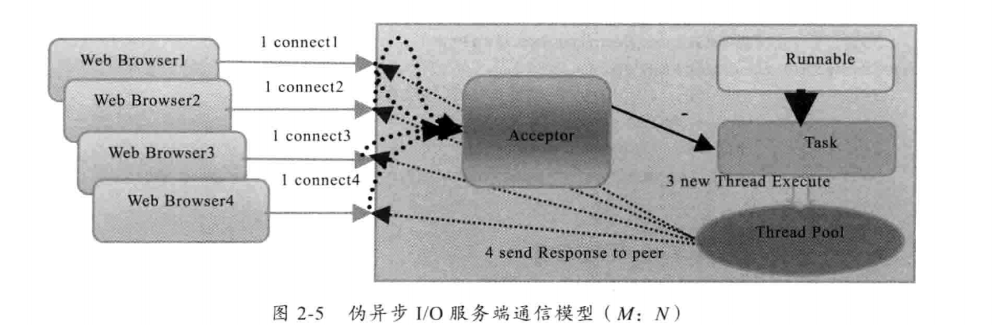

# 伪异步IO模型图

- bio一个链路需要一个线程
- 改进成了线程池处理多个client请求

`缺陷的本质`
- java同步的API
Socket输入流进行读取操作时，它会一直阻塞下去，有3个事件
    1. 有数据可读
    2. 可用的数据已经读取完毕
    3. 发生空指针或者I/O异常

意味着，如果对方发送请求or应答慢or网络协议慢。读取输入流一方通信线程将被长时间阻塞。其他接入消息只能在消息队列排队。
- OutputStream的write方法写输出流时会被阻塞，直到所有要发送的字节全部写入完毕or发出异常。
    1.当消息接受方处理缓慢，则不能及时从TCP缓冲区读取信息，导致TCP的window size不断减小，直到为0。
    2.双方出于Keep-Alive状态，消息发送方不能再从TCP的缓冲区写入消息。
    3.如果此时采用同步阻塞I/O,write操作将会被无限期阻塞，知道TCP window size大于0 or I/O异常
- 输入输出流的读和写都是同步阻塞的。其时间取决于对方I/O线程的处理速度和网络I/O传输速度

`如果通信对方返回应答时间过长，会引起的级联故障（伪异步I/O)`

- 服务端处理缓慢，返回应答消息耗费60s，正常为10ms
- 采用伪异步I/O的线程正在读取故障服务节点的响应，由于读取输入流是阻塞的，会被同步阻塞60s
- 假如所有可用线程都被故障服务器阻塞。后续所有I/O消息都将在队列中排队
- 由于线程池采用阻塞队列实现，队列堆积后，后续入队列的操作将被阻塞
- 由于前端只有一个Accentor线程接收客户端接入。其被阻塞在线程池的同步阻塞队列后，新的客户端请求消息将被拒绝，客户端会发生大量请求超时
- 所有connection time out，调用者会认为系统崩溃，无法接收新的消息
.gitignore