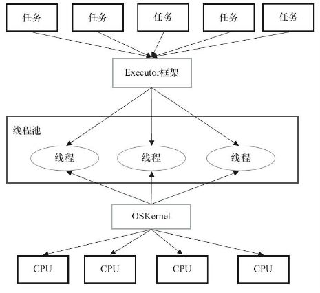
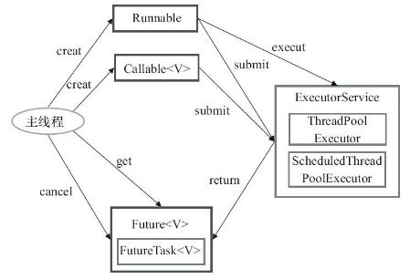
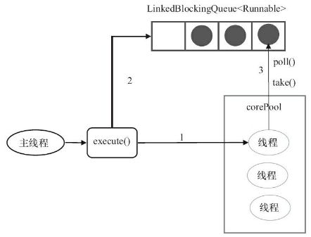
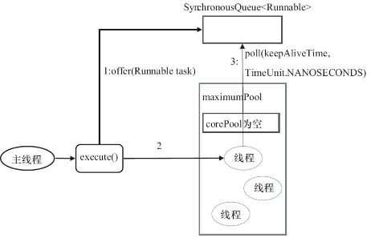
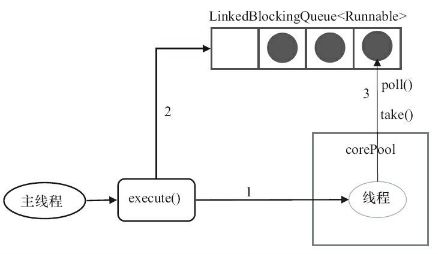
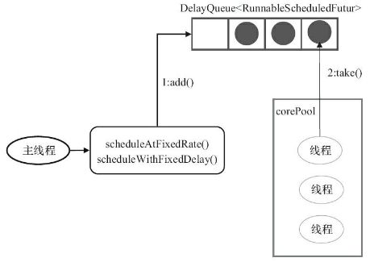

# 伪异步IO流程
`Client的Socket封装成Task(Runnable接口)`
- 每当有一个新的客户端请求接入时，封装成
- 服务端创建线程池
- 线程池处理n个客户端连接


### 底层通信依旧是同步阻塞模型，无法从根本解决问题


# API
### ThreadPoolExecutor线程池
```java
public ThreadPoolExecutor(int corePoolSize,
                              int maximumPoolSize,
                              long keepAliveTime,
                              TimeUnit unit,
                              BlockingQueue<Runnable> workQueue,
                              ThreadFactory threadFactory,
                              RejectedExecutionHandler handler)
```
- corePoolSize：线程池核心线程数（平时保留的线程数）
- maximumPoolSize：线程池最大线程数（当workQueue都放不下时，启动新线程，最大线程数）
- keepAliveTime：超出corePoolSize数量的线程的保留时间。
- unit：keepAliveTime单位
- workQueue：阻塞队列，存放来不及执行的线程
 1. ArrayBlockingQueue：构造函数一定要传大小
 2. LinkedBlockingQueue：构造函数不传大小会默认为（Integer.MAX_VALUE ），当大量请求任务时，容易造成 内存耗尽。
 3. SynchronousQueue：同步队列，一个没有存储空间的阻塞队列 ，将任务同步交付给工作线程。
 4. PriorityBlockingQueue : 优先队列
- threadFactory：线程工厂
- handler：饱和策略
 1. AbortPolicy（默认）：直接抛弃
 2. CallerRunsPolicy：用调用者的线程执行任务
 3. DiscardOldestPolicy：抛弃队列中最久的任务
 4. DiscardPolicy：抛弃当前任务
 
 
 ### 线程池的实现原理
 
 线程池一般由两种角色构成：多个工作线程 和 一个阻塞队列。
 
 - 工作线程
  
  工作线程是一组已经处在运行中的线程，它们不断地向阻塞队列中领取任务执行。
 - 阻塞队列
 
 阻塞队列用于存储工作线程来不及处理的任务。当工作线程都在执行任务时，到来的新任务就只能暂时在阻塞队列中存储。

### 提交任务

可以向ThreadPoolExecutor提交两种任务：Callable和Runnable。

- Callable

该类任务有返回结果，可以抛出异常。
通过submit函数提交，返回Future对象。
可通过get获取执行结果。

- Runnable

该类任务只执行，无法获取返回结果，并在执行过程中无法抛异常。
通过execute提交。

### 关闭线程池

关闭线程池有两种方式：shutdown和shutdownNow，关闭时，会遍历所有的线程，调用它们的interrupt函数中断线程。但这两种方式对于正在执行的线程处理方式不同。

- shutdown()

仅停止阻塞队列中等待的线程，那些正在执行的线程就会让他们执行结束。
- shutdownNow()

不仅会停止阻塞队列中的线程，而且会停止正在执行的线程。

### ThreadPoolExecutor运行机制

当有请求到来时：

- 若当前实际线程数量 少于 corePoolSize，即使有空闲线程，也会创建一个新的工作线程；
- 若当前实际线程数量处于corePoolSize和maximumPoolSize之间，并且阻塞队列没满，则任务将被放入阻塞队列中等待执行；
- 若当前实际线程数量 小于 maximumPoolSize，但阻塞队列已满，则直接创建新线程处理任务；
- 若当前实际线程数量已经达到maximumPoolSize，并且阻塞队列已满，则使用饱和策略。

### 设置合理的线程池大小

任务一般可分为：CPU密集型、IO密集型、混合型，对于不同类型的任务需要分配不同大小的线程池。

- CPU密集型任务

尽量使用较小的线程池，一般为CPU核心数+1。
因为CPU密集型任务使得CPU使用率很高，若开过多的线程数，只能增加上下文切换的次数，因此会带来额外的开销。
- IO密集型任务

可以使用稍大的线程池，一般为2*CPU核心数。
IO密集型任务CPU使用率并不高，因此可以让CPU在等待IO的时候去处理别的任务，充分利用CPU时间。
- 混合型任务

可以将任务分成IO密集型和CPU密集型任务，然后分别用不同的线程池去处理。
只要分完之后两个任务的执行时间相差不大，那么就会比串行执行来的高效。
因为如果划分之后两个任务执行时间相差甚远，那么先执行完的任务就要等后执行完的任务，最终的时间仍然取决于后执行完的任务，而且还要加上任务拆分与合并的开销，得不偿失。

### Executor两级调度模型

- 在HotSpot虚拟机中，Java中的线程将会被一一映射为操作系统的线程。
- 在Java虚拟机层面，用户将多个任务提交给Executor框架，Executor负责分配线程执行它们。在操作系统层面，操作系统再将这些线程分配给处理器执行。

### Executor结构


Executor框架中的所有类可以分成三类：

- 任务

任务有两种类型：Runnable和Callable。
- 任务执行器

Executor框架最核心的接口是Executor，它表示任务的执行器。
Executor的子接口为ExecutorService。
ExecutorService有两大实现类：ThreadPoolExecutor和ScheduledThreadPoolExecutor。
- 执行结果

Future接口表示异步的执行结果，它的实现类为FutureTask。

### 线程池

Executors工厂类可以创建四种类型的线程池，通过Executors.newXXX即可创建。

- FixedThreadPool
```java
public static ExecutorService newFixedThreadPool(int nThreads){
    return new ThreadPoolExecutor(nThreads,nThreads,0L,TimeUnit.MILLISECONDS,new LinkedBlockingQueue<Runnable>());
}
```


- 它是一种固定大小的线程池
- corePoolSize和maximunPoolSize都为用户设定的线程数量nThreads
- keepAliveTime为0，意味着一旦有多余的空闲线程，就会被立即停止掉；但这里keepAliveTime无效
- 阻塞队列采用了LinkedBlockingQueue，它是一个无界队列
- 由于阻塞队列是一个无界队列，因此永远不可能拒绝任务
- 由于采用了无界队列，实际线程数量将永远维持在nThreads，因此maximumPoolSize和keepAliveTime将无效


- CachedThreadPool
```java
public static ExecutorService newCachedThreadPool(){
    return new ThreadPoolExecutor(0,Integer.MAX_VALUE,60L,TimeUnit.MILLISECONDS,new SynchronousQueue<Runnable>());
}
```


- 它是一个可以无限扩大的线程池
- 它比较适合处理执行时间比较小的任务
- corePoolSize为0，maximumPoolSize为无限大，意味着线程数量可以无限大
- keepAliveTime为60S，意味着线程空闲时间超过60S就会被杀死
- 采用SynchronousQueue装等待的任务，这个阻塞队列没有存储空间，这意味着只要有请求到来，就必须要找到一条工作线程处理他，如果当前没有空闲的线程，那么就会再创建一条新的线程

-  SingleThreadExecutor
```java
public static ExecutorService newSingleThreadExecutor(){
    return new ThreadPoolExecutor(1,1,0L,TimeUnit.MILLISECONDS,new LinkedBlockingQueue<Runnable>());
}
```


- 它只会创建一条工作线程处理任务；
- 采用的阻塞队列为LinkedBlockingQueue；


- ScheduledThreadPool
它用来处理延时任务或定时任务。

- 它接收SchduledFutureTask类型的任务，有两种提交任务的方式：
 1. scheduledAtFixedRate
 2. scheduledWithFixedDelay
- SchduledFutureTask接收的参数：
 1. time：任务开始的时间
 2. sequenceNumber：任务的序号
 3. period：任务执行的时间间隔
- 它采用DelayQueue存储等待的任务
 1. DelayQueue内部封装了一个PriorityQueue，它会根据time的先后时间排序，若time相同则根据sequenceNumber排序
 2. DelayQueue也是一个无界队列；
- 工作线程的执行过程：
 1. 工作线程会从DelayQueue取已经到期的任务去执行
 2. 执行结束后重新设置任务的到期时间，再次放回DelayQueue


### 阿里巴巴java开发手册
线程池不使用 Executors 去创建，而是通过 ThreadPoolExecutor 的方式，这样的处理方式让写的同学更加明确线程池的运行规则，规避资源耗尽的风险。

##### Executors 返回的线程池对象的弊端如下：

- FixedThreadPool 和 SingleThreadPool 
 允许的请求队列长度为 Integer.MAX_VALUE ，可能会堆积大量的请求，从而导致 OOM (OutOfMemory)。
- CachedThreadPool 和 ScheduledThreadPool 
 允许的创建线程数量为 Integer.MAX_VALUE ，可能会创建大量的线程，从而导致 OOM 。