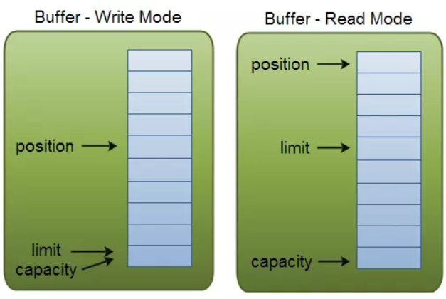
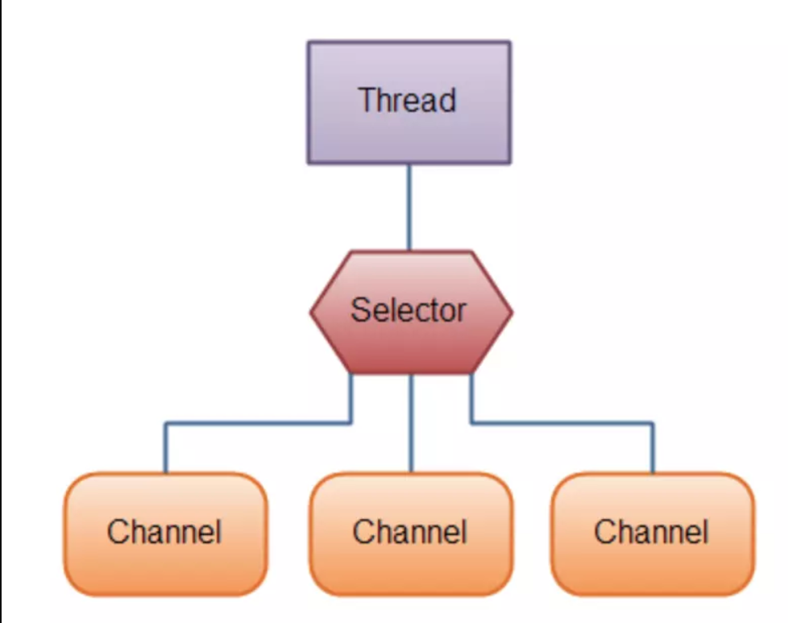
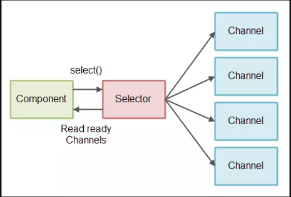

# NIO

##### jdk1.4引入。
- 弥补了原来同步阻塞I/O不足
- 在java代码中提供了高速,面向块I/O
- 通过定义包含数据的类，以块的形式处理

##NIO核心API Channel, Buffer, Selector

#### 通道Channel
NIO的通道类似于流，但有些区别

1. 通道可以同时进行读写，而流只能读或者只能写

2. 通道可以实现异步读写数据

3. 通道可以从缓冲读数据，也可以写数据到缓冲

- 流只能在一个方向移动(一个流必须是InputStream/OutStream的自类)而Channel
- Channel是全双工的，比流更好映射到底层操作系统API，UNIX网络编程模型底层操作系统通道都是全双工的。同时支持读写操作

###### Channel分为两类
- 网络读写SelectableChannel
- 文件操作的FileChannel

ServerSocketChannel和SocketChannel都是SelectableChannel的子类

#### 缓冲区buffer
- 原IO将数据直接读入Stream
- NIO是面向缓冲区的。数据读取到一个它稍后处理的缓冲区，需要时可在缓冲区中前后移动，这就增加了处理过程中的灵活性。
- 缓冲区本质是一个数组。
  通常是字节数组(ByteBuffer)也可以是其他的。
  Byte/Char/Short/Int/Long/Float/Double Buffer
  
`缓冲区本质上是一个可以写入数据的内存块，然后可以再次读取，该对象提供了一组方法，可以更轻松地使用内存块，使用缓冲区读取和写入数据通常遵循以下四个步骤：`
  
1. 写数据到缓冲区
2. 调用buffer.flip()方法
3. 从缓冲区中读取数据
4. 调用buffer.clear()或buffer.compat()方法

当向buffer写入数据时，buffer会记录下写了多少数据，一旦要读取数据，需要通过flip()方法将Buffer从写模式切换到读模式，在读模式下可以读取之前写入到buffer的所有数据，一旦读完了所有的数据，就需要清空缓冲区，让它可以再次被写入
  
**Buffer在与Channel交互时，需要一些标志**
- buffer的大小/容量 - Capacity

作为一个内存块，Buffer有一个固定的大小值，用参数capacity表示。

- 当前读/写的位置 - Position​
  
当写数据到缓冲时，position表示当前待写入的位置，position最大可为capacity – 1；当从缓冲读取数据时，position表示从当前位置读取。

- 信息末尾的位置 - limit
  
在写模式下，缓冲区的limit表示你最多能往Buffer里写多少数据； 写模式下，limit等于Buffer的capacity，意味着你还能从缓冲区获取多少数据。

**下图展示了buffer中三个关键属性capacity，position以及limit在读写模式中的说明：**

- 向缓冲区写数据
 
     1. 从Channel写到Buffer
     2. 通过Buffer的put方法写到Buffer中
  
 - 从缓冲区读取数据
     1. 从Buffer中读取数据到Channel
     2. 通过Buffer的get方法从Buffer中读取数据

- flip方法
     
     将Buffer从写模式切换到读模式，将position值重置为0，limit的值设置为之前position的值
     
 - clear方法 vs compact方法
    
    clear方法清空缓冲区；compact方法只会清空已读取的数据，而还未读取的数据继续保存在Buffer中
  
#### Selector

- 一个组件，可以检测多个NIO channel，看看读或者写事件是否就绪。

- 多个Channel以事件的方式可以注册到同一个Selector，从而达到用一个线程处理多个请求成为可能。

一个thread对应多个channel,一个channel处理一个请求。

调用Selector的select()或者 selectNow() 方法它只会返回有数据读取的SelectableChannel的实例.