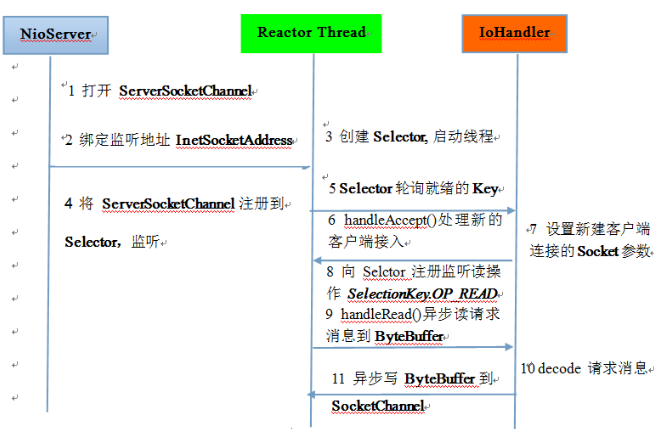
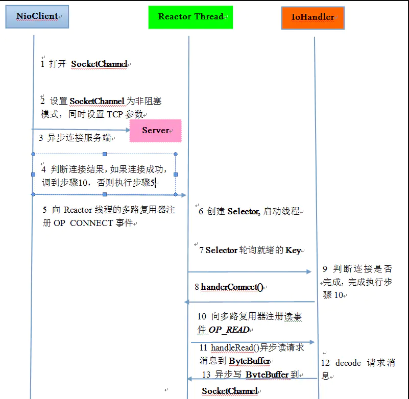

# NIO

#### 服务端时序图

配合TimeServerNIO代码，这里的ioHandler代码没有实现。Reactor Thread是main里的启动线程

- [客户端代码](https://github.com/kiwi5691/NetworkCommunication/blob/master/javaIO/NIO/src/main/java/nio/TimeClientNio.java)
- [服务端代码](https://github.com/kiwi5691/NetworkCommunication/blob/master/javaIO/NIO/src/main/java/nio/TimeServerNio.java)

#### 客户端时序图

同上服务端

### 说明
`
由于SocketChannel是异步非阻塞，并不会一次性把需要的字节发送完。
此时会出现‘写半包’问题，我们需要组成写操作，不断轮询Selector将没有发送完的ByteBuffer发送完毕
可使用ByteBuffer的hasRemaining()方法判断消息是否完成
`
这里并没有在NIO中考虑半包写，半包读的情况，不然代码会更复杂

### nio的优点

- client连接操作都是异步的，可通过在多路复用器注册OP_CONNECT等待后续结果，不需要像之前的客户端那样被同步阻塞

- SocketChannel的读写都是异步的，如果无可读性数据不会同步等待，直接返回
- 线程模型的优化

JDK的selector在linux等系统通过epoll实现，其无连接句柄的限制（只受限于操作系统的最大句柄数or单个进程的句柄限制）。其意味着一个Selector线程可以同时处理成千上万个客户端连接，并且性能不会随着客户端的增加而线性下降。
适合高性能，高负载的网络服务器
