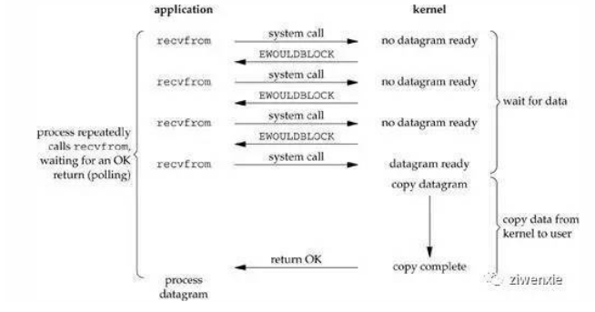
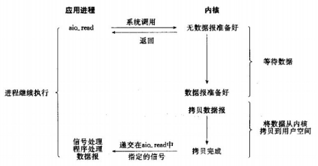

# Linux/Unix网络IO模型

## 概念
- 程序空间与内核空间

在Linux中，对于一次读取IO的操作，数据并不会直接拷贝到程序的程序缓冲区。它首先会被拷贝到操作系统内核的缓冲区中，然后才会从操作系统内核的缓冲区拷贝到应用程序的缓冲区。p.s: 最后一句话非常重要，重复一遍。
 1. Waiting for the data to be ready(等待数据到达内核缓冲区)

 2. Copying the data from the kernel to the process(从内核缓冲区拷贝数据到程序缓冲区)

- 文件描述符

 在Linux下面一切皆文件， 文件描述符(file descriptor)是内核为文件所创建的索引，
 所有I/O操作都通过调用文件描述符(索引)来执行，包括下面我们要提到的socket。
 Linux刚启动的时候会自动设置0是标准输入，1是标准输出，2是标准错误。
 
## blocking IO(阻塞IO)
 
- 进程调用一个recvfrom请求，但是它不能立刻收到回复，直到数据返回，然后将数据从内核空间复制到程序空间。
 
 1. Waiting for the data to be ready(等待数据到达内核缓冲区)
 
 2. Copying the data from the kernel to the process(从内核缓冲区拷贝数据到程序缓冲区)
 

## nonblocking IO(非阻塞IO)
   
- 当我们设置一个socket为nonblocking(非阻塞)，相当于告诉内核当我们请求的IO操作不能立即得到返回结果，不要把进程设置为sleep状态，而是返回一个错误信息(EWOULDBLOCK)。 
- 前三次我们调用recvfrom请求，但是并没有数据返回，所以内核只能返回一个错误信息(EWOULDBLOCK)。但是当我们第四次调用recvfrom，数据已经准备好了，然后将它从内核空间复制到程序空间。
- 在非阻塞状态下，我们的过程一(wait for data)并不是完全的阻塞的，但是过程二(copy data from kernel to user)依然处于一个阻塞状态。

`在这个不断测试的过程中，会大量的占用CPU的时间`

## IO multiplexing(IO复用)
- IO复用的好处是我们可以通过(select/poll/epoll)一个时刻处理多个文件描述符
  
 
 
 

- 主要是select和epoll两个系统调用。对一个IO端口，两次调用，两次返回，比阻塞IO并没有什么优越性；关键是能实现同时对多个IO端口进行监听
- I/O复用模型会用到select、poll、epoll函数，这几个函数也会使进程阻塞，但是和阻塞I/O所不同的的，这两个函数可以同时阻塞多个I/O操作。
- 而且可以同时对多个读操作，多个写操作的I/O函数进行检测，直到有数据可读或可写时，才真正调用I/O操作函数。
- 当用户进程调用了select，那么整个进程会被block。而同时，kernel会“监视”所有select负责的socket；当任何一个socket中的数据准备好了，select就会返回。
- 这个时候，用户进程再调用read操作，将数据从kernel拷贝到用户进程。
- 这个图和blocking IO的图其实并没有太大的不同，事实上还更差一些。
- 因为这里需要使用两个系统调用(select和recvfrom)，而blocking IO只调用了一个系统调用(recvfrom)。但是，用select的优势在于它可以同时处理多个connection。（如果处理的连接数不是很高的话，使用select/epoll的web server不一定比使用multi-threading + blocking IO的web server性能更好，可能延迟还更大。select/epoll的优势并不是对于单个连接能处理得更快，而是在于能处理更多的连接。）

## signal driven IO(信号驱动IO)

- 使用信号驱动IO，要求内核通知我们当文件描述符准备就绪以后发送相应的信号。

  
  
  

- 阶段1: 我们首先设置socket为一个信号驱动IO，并且通过sigaction system call安装一个signal handler，注意这个过程是瞬时的，所以这个阶段是非阻塞的。 
- 阶段2 : 当数据已经准备好了以后，一个SIGIO信号传送给我们的进程告诉我们数据准备好了，然后进程开始等待数据从内核空间复制到程序空间(copy data from kernel to user)，这个过程是阻塞的，因为我们的进程只能等待数据复制完毕。

## asynchronous IO(异步IO)

- 异步就是说对于上面两个步骤(wait for data 和copy of the data from the kernel to our buffer)当它们完成的时候会自动通知进程，
- 在这段时间里面进程什么都不用操心，只需要等待callback。 相比前面的信号驱动IO，异步IO两个阶段都是非阻塞的。

  
  
  
  
  
 ## 比较
 
- 阻塞式IO(默认)，非阻塞式IO(nonblock)，IO复用(select/poll/epoll)，signal driven IO(信号驱动IO)都是属于同步型IO
- 因为在第二个阶段: 从内核空间拷贝数据到程序空间的时候不能干别的事。只有异步I/O模型(AIO)才是符合我们上面对于异步型IO操作的含义，
- 在1.wait for data，2.copy data from kernel to user，这两个等待/接收数据的时间段内进程可以干其他的事情，只要等着被通知就可以了。
 
  
  
  
## select、poll、epoll
- 支持一个进程所能打开的最大连接数

 |  select   |  单个进程所能打开的最大连接数有FD_SETSIZE宏定义，其大小是32个整数的大小（在32位的机器上，大小就是32*32，同理64位机器上FD_SETSIZE为32*64），当然我们可以对进行修改，然后重新编译内核，但是性能可能会受到影响。|
 |  ----  | ----  |
 | poll  |  poll本质上和select没有区别，但是它没有最大连接数的限制，原因是它是基于链表来存储的 |
 | epoll  |  虽然连接数有上限，但是很大，1G内存的机器上可以打开10万左右的连接，2G内存的机器可以打开20万左右的连接 |
 

- FD剧增后带来的IO效率问题
|  select   | 因为每次调用时都会对连接进行线性遍历，所以随着FD的增加会造成遍历速度慢的“线性下降性能问题。  |
|  ----  | ----  |
| poll  | 同select |
| epoll  | 因为epoll内核中实现是根据每个fd上的callback函数来实现的，只有活跃的socket才会主动调用callback，所以在活跃socket较少的情况下，使用epoll没有前面两者的线性下降的性能问题，但是所有socket都很活跃的情况下，可能会有性能问题。 |
 

- 消息传递方式

|  select   | 内核需要将消息传递到用户空间，都需要内核拷贝动作  |
|  ----  | ----  |
| poll  | 同select |
| epoll  | epoll通过内核和用户空间共享一块内存来实现的。 |
 
 
 
 ##### 在选择select，poll，epoll时要根据具体的使用场合以及这三种方式的自身特点。
  1. 表面上看epoll的性能最好，但是在连接数少并且连接都十分活跃的情况下，select和poll的性能可能比epoll好，毕竟epoll的通知机制需要很多函数回调。
       
  2. select低效是因为每次它都需要轮询。但低效也是相对的，视情况而定，也可通过良好的设计改善

# 边缘/水平触发

- Level_triggered(水平触发)

当被监控的文件描述符上有可读写事件发生时，epoll_wait()会通知处理程序去读写。如果这次没有把数据一次性全部读写完(如读写缓冲区太小)，那么下次调用 epoll_wait()时，它还会通知你在上没读写完的文件描述符上继续读写，当然如果你一直不去读写，它会一直通知你。
如果系统中有大量你不需要读写的就绪文件描述符，而它们每次都会返回，这样会大大降低处理程序检索自己关心的就绪文件描述符的效率。

- Edge_triggered(边缘触发)

当被监控的文件描述符上有可读写事件发生时，epoll_wait()会通知处理程序去读写。如果这次没有把数据全部读写完(如读写缓冲区太小)，那么下次调用epoll_wait()时，它不会通知你，也就是它只会通知你一次，直到该文件描述符上出现第二次可读写事件才会通知你。
这种模式比水平触发效率高，系统不会充斥大量你不关心的就绪文件描述符。

 select(),poll()模型都是水平触发模式，信号驱动IO是边缘触发模式，epoll()模型即支持水平触发，也支持边缘触发，默认是水平触发。