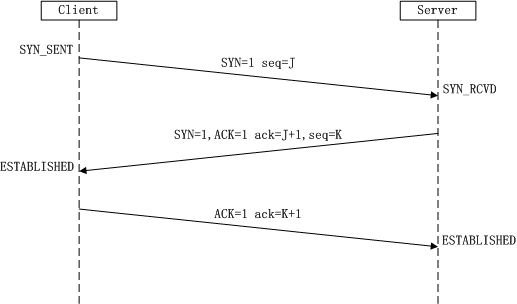

# TCP
`来自计网`
### TCP的连接
### 可靠传输的工作原理
#### 停止等待协议
1. 无差错情况
2. 出现差错

超时重传
3. 确认丢失和确认迟到
4. 信道利用率
### 连续的ARQ协议
滑动窗口协议 

### TCP报文段的首部格式

### TCP可靠传输的实现
#### 以字节为单位的滑动窗口
#### 超时重传时间的选择
#### 选择确认SACK

### TCP的流量控制
#### 利用滑动窗口实现流量控制

### TCP的拥塞控制
#### 拥塞控制方法

### TCP的运输连接管理
#### TCP的连接释放
#### TCP的有限状态机
# TCP三次握手协议 

#### client与到server建立TCP连接
-  client 发送 syn 到server 发起握手（同步请求）
-  server 收到 syn后回复syn+ack给client（同步请求应答）
-  client 收到syn+ack后，回复server一个ack表示收到了server的syn+ack
- TCP的一次连接（三次握手）的过程就建立了

 

#### 三次握手
在TCP/IP协议中,TCP协议提供可靠的连接服务,采用三次握手建立一个连接。
 1. 第一次握手：建立连接时,客户端发送syn包(syn=j)到服务器,并进入SYN_SEND状态,等待服务器确认； 
    SYN：同步序列编号(Synchronize Sequence Numbers)
 2.   第二次握手：服务器收到syn包,必须确认客户的SYN（ack=j+1）,同时自己也发送一个SYN包（syn=k）,即SYN+ACK包,此时服务器进入SYN_RECV状态； 
 3.   第三次握手：客户端收到服务器的SYN＋ACK包,向服务器发送确认包ACK(ack=k+1),此包发送完毕,客户端和服务器进入ESTABLISHED状态,完成三次握手.
完成三次握手,客户端与服务器开始传送数据
 
 
 
 
 ###  TCP握手过程中建连接的流程和队列
 
  

两个队列：
- syns queue(半连接队列）
- accept queue（全连接队列）
 
 
 #### backlog
 
 TCP建立连接是要进行三次握手，但是否完成三次握手后，服务器就处理（accept）呢。
 backlog其实是一个连接队列，在Linux内核2.2之前，backlog大小包括半连接状态和全连接状态两种队列大小。
 - 半连接状态为：
 
 服务器处于Listen状态时收到客户端SYN报文时放入半连接队列中，即SYN queue（服务器端口状态为：SYN_RCVD）。
 - 全连接状态为：
 
 
 **TCP的连接状态从服务器（SYN+ACK）响应客户端后，到客户端的ACK报文到达服务器之前，则一直保留在半连接状态中；当服务器接收到客户端的ACK报文后，该条目将从半连接队列搬到全连接队列尾部，即 accept queue （服务器端口状态为：ESTABLISHED）。**
- SYN queue 队列长度由 /proc/sys/net/ipv4/tcp_max_syn_backlog 指定，默认为2048。
- Accept queue 队列长度由 /proc/sys/net/core/somaxconn 和使用listen函数时传入的参数，二者取最小值。默认为128。在Linux内核2.4.25之前，是写死在代码常量 SOMAXCONN ，在Linux内核2.4.25之后，在配置文件 /proc/sys/net/core/somaxconn 中直接修改，或者在 /etc/sysctl.conf 中配置 net.core.somaxconn = 128 。
 
 客户端connect()返回不代表TCP连接建立成功，有可能此时accept queue 已满，系统会直接丢弃后续ACK请求；客户端误以为连接已建立，开始调用等待至超时；服务器则等待ACK超时，会重传SYN+ACK 给客户端，重传次数受限 net.ipv4.tcp_synack_retries ，默认为5，表示重发5次，每次等待30~40秒，即半连接默认时间大约为180秒，该参数可以在tcp被洪水攻击是临时启用这个参数。
 
 
 在Linux内核2.2之后，分离为两个backlog来分别限制半连接（SYN_RCVD状态）队列大小和全连接（ESTABLISHED状态）队列大小。
 
 
 #### 易出现的问题
 
 - 全连接队列
 - 半连接队列溢出